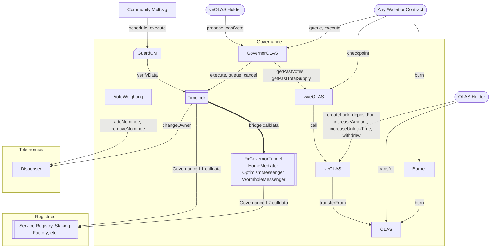

# Governance Flowchart

```mermaid
graph TD
    %% Governance
    subgraph governance [Governance]
    Burner[Burner]
    BridgeMediator[[FxGovernorTunnel HomeMediator OptimismMessenger WormholeMessenger]]
    GovernorOLAS[GovernorOLAS]
    GuardCM@{ shape: notch-rect, label: "GuardCM" }
    OLAS[OLAS]
    Timelock@{ shape: div-rect, label: "Timelock" }
    veOLAS[veOLAS]
    VoteWeighting[VoteWeighting]
    wveOLAS[wveOLAS]
    end
    
    %% Registries
    subgraph registries [Registries]
    ServiceRegistry[[Service Registry, Staking Factory, etc.]]
    end
    
    %% Tokenomics
    subgraph tokenomics [Tokenomics]
    Dispenser[Dispenser]
    end
    
    AnyWallet([Any Wallet or Contract])
    CM[Community Multisig]
    veOLAS_Wallet([veOLAS Holder])
    OLAS_Holder([OLAS Holder])
    
    AnyWallet-->|checkpoint|wveOLAS
    AnyWallet-->|queue, execute|GovernorOLAS
    AnyWallet-->|burn|Burner
    BridgeMediator-->|Governance L2 calldata|ServiceRegistry
    Burner-->|burn|OLAS
    CM-->|schedule, execute|GuardCM
    GovernorOLAS-->|execute, queue, cancel|Timelock
    GovernorOLAS-->|getPastVotes, getPastTotalSupply|wveOLAS
    GuardCM-->|verifyData|Timelock
    OLAS_Holder-->|createLock, depositFor, increaseAmount, increaseUnlockTime, withdraw|veOLAS
    OLAS_Holder-->|transfer|OLAS
    Timelock-->|changeOwner|Dispenser
    Timelock==>|bridge calldata|BridgeMediator
    Timelock-->|Governance L1 calldata|ServiceRegistry
    veOLAS-->|transferFrom|OLAS
    veOLAS_Wallet-->|propose, castVote|GovernorOLAS
    VoteWeighting-->|addNominee, removeNominee|Dispenser
    wveOLAS-->|call|veOLAS
```
